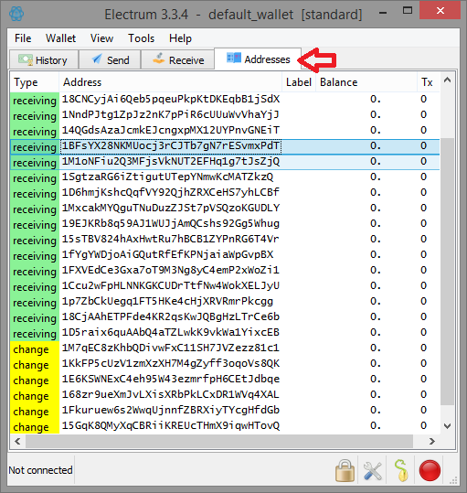
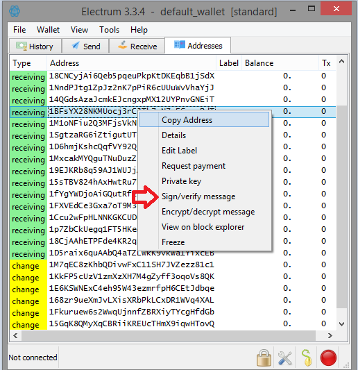

# Blockchain Identity (BDND - Connect)

This repo demonstrates how you can sign and verify messages using ```Electrum``` & ```bitcoinjs-message``` Node JS pacakge. This is to help students for their project ```Create Your Identity on Bitcoin Core```.

### Tools Nedded
- Download & install [Electrum](https://electrum.org/#home).
- Download & install [Node JS](https://nodejs.org/).
- Use any text editors of your likeing (I personally use [VS Code](https://code.visualstudio.com/)).

### Using the code

Using ```git```, from your terminal clone this repo
```
git clone https://github.com/muradmm83/bdndc-session1
```

Change directory to ```bdndc-session1```
```
cd bdndc-session1
```

Install all dependencies
```
npm install
```

Modify the code inside ```app.js``` (details will be covered in the session) and run the application
```
npm start
```

### Using Electrum
To get a list of available address select ```Addresses``` tab



Right click on any of the addresses and you'll get many options, one of them is ```sign/verify message```



After clicking on ```sign/verify message``` you get the following popup, which you'll be using to sign/verify a message. If you sign a message you'll get a ```signature```, to verify a message you need a ```signature```


